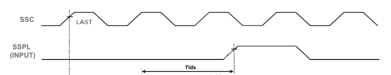
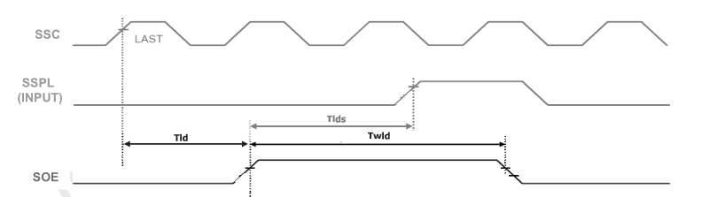
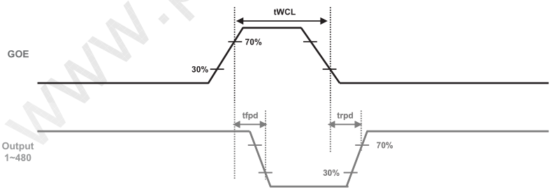
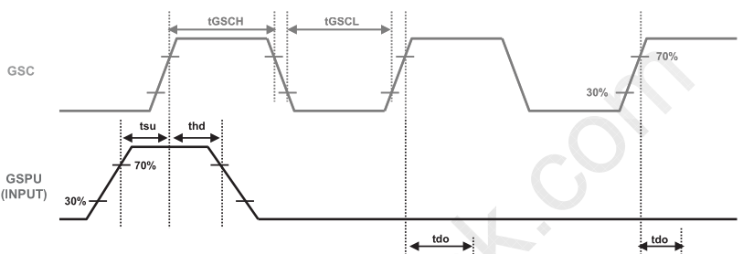
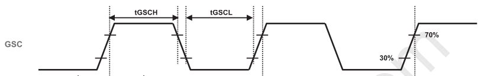
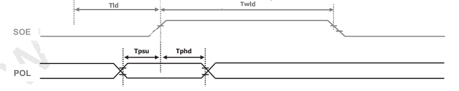

# Pico TCON — how the firmware implements the LA070WV1 D-IC timing

This document maps the timing the panel's driver ICs require (LA070WV1-TD01
datasheet, Ver 1.0, 2010-10-26) onto the PIO state-machine programs in
`pico_tcon/src/main.rs`.

## Display Driver ICs

- **Source D-IC** (datasheet Fig. 1) — the **column** drivers. They shift in the
  pixel data for one line and drive the 800×3 source lines. Input strobes:
  `SSC` (source shift clock), `Data`, `REV`, `SSPL`/`SSPR` (start-pulse in/out),
  `SOE` (source output enable), `POL` (polarity).
- **Gate D-IC** (datasheet Fig. 2) — the **row** drivers. They select which of
  the 480 rows is active. Input strobes: `GSC` (gate shift clock),
  `GSPU`/`GSPD` (gate start pulse up/down), `GOE` (gate output enable).

The Raspberry Pi (via DPI) supplies `SSC`/`Data`/`REV` and the frame sync
(HSYNC/VSYNC/DE). The **Pico regenerates every other strobe** — the pulses whose
exact width and phase the datasheet pins down and that a general-purpose display
controller can't emit cleanly. PIO0 does the source-side strobes, PIO1 the
gate-side strobes.

## Datasheet timing parameters (§6-4, Ta=25 °C)

### Source D-IC (Fig. 1)

| Parameter | Symbol | Min | Typ | Max | Unit |
|---|---|---:|---:|---:|---|
| SSC frequency | fclk | 31.95 | 33.26 | 34.60 | MHz |
| SSC pulse width | Tcw | 9 | – | – | ns |
| DATA/REV/SSPL/SSPR setup | Tsu | 4 | – | – | ns |
| DATA/REV/SSPL/SSPR hold | Thd | 2 | – | – | ns |
| SSPR delay | Tphl | 5 | 10 | 15 | ns |
| Last data → SOE | Tld | 1 | – | – | Tclk |
| SOE pulse width | Twld | 2 | – | – | Tclk |
| SOE → SSPL | Tlds | 5 | – | – | Tclk |
| POL setup (to SOE) | Tpsu | 6 | – | – | ns |
| POL hold (to SOE) | Tphd | 6 | – | – | ns |

`Tclk` = one SSC period. At our ~33.3 MHz pixel clock, 1 Tclk ≈ 30 ns.

### Gate D-IC (Fig. 2)

| Parameter | Symbol | Min | Typ | Max | Unit |
|---|---|---:|---:|---:|---|
| GSC frequency | fGSC | 31.2 | 31.5 | 31.8 | kHz |
| GSC/GOE/GSPU/GSPD rise | tr_in | – | – | 100 | ns |
| GSC/GOE/GSPU/GSPD fall | tf_in | – | – | 100 | ns |
| GSC pulse width | tGSCH, tGSCL | 500 | – | – | ns |
| GSPU/GSPD setup | tsu | 200 | – | – | ns |
| GSPU/GSPD hold | thd | 300 | – | – | ns |
| Driver output delay | tdo | – | – | 900 | ns |
| GOE pulse width | tWCL | 1 | – | – | µs |
| Output delay | trpd, tfpd | – | – | 900 | ns |

Note fGSC ≈ 31.5 kHz is exactly the **line rate** — one GSC edge per horizontal
line (527 lines × 60 Hz ≈ 31.6 kHz). GSC is the "next row" clock.

---

## Clock domain

All six PIO state machines run at the RP2040's default 125 MHz. The datasheet
values are in nanoseconds / Tclk; the code counts 125 MHz system cycles
(1 cycle = 8 ns), so every delay below is quoted in both.

---

# Source side (PIO0)

## 1. SSPL — source start pulse

**Datasheet (Fig. 1, top block).** `SSPL (INPUT)` is a one-shot pulse per line
that tells the source shift register "first pixel starts now." It must meet
`Tsu`=4 ns setup / `Thd`=2 ns hold against `SSC`, i.e. its edges must be clean
relative to a pixel-clock edge.



*Datasheet Fig. 1 (Source D-IC) — SSPL is one SSC-clock wide, with its edges
aligned to SSC so it meets Tsu = 4 ns setup / Thd = 2 ns hold.*

**Firmware.** The state machine triggers on the HSYNC rising edge (back porch
start), runs a system-clock delay (~344 cycles) to reach the first active pixel,
and fires the rising edge directly:

```asm
"wait 0 gpio 4",      // wait for HSYNC low
"wait 1 gpio 4",      // wait for HSYNC high (back porch start)
"set y, 7",           // outer×inner delay loop -> ~344 sys cycles
"sspl_y:",
"set x, 7",
"sspl_x:",
"jmp x-- sspl_x [4]",
"jmp y-- sspl_y [1]",
"set pins, 1",        // SSPL high (fired directly off the delay)
"wait 0 gpio 2",      // hold ~one SSC period
"wait 1 gpio 2",
"set pins, 0",        // SSPL low
```

The delay count sets the image's **horizontal position** (the back-porch length in
Pico cycles). Two properties keep it centered and stable:

- The delay runs on the Pico's 125 MHz clock, a separate oscillator from the Pi's
  pixel clock. `h_total` is kept divisible by 4 (976 px = 3660 Pico clocks), so
  each HSYNC falls on the same Pico-clock phase and the delay endpoint does not
  drift against SSC.
- The rising edge is fired directly, with no SSC-align wait before it. DE and SSC
  are phase-coincident, so a pre-pulse `wait gpio 2` would resolve ±1 SSC per line
  and shift the pulse position; it is omitted. The `wait gpio 2` pair after the
  rising edge sets only the pulse width.

## 2. SOE — source output enable

**Datasheet (Fig. 1, lower block).** After the last data of a line is clocked in,
`SOE` strobes the latched line onto the source outputs. Three constraints:
`Tld`≥1 Tclk (last data → SOE), `Twld`≥2 Tclk (SOE pulse width), `Tlds`≥5 Tclk
(SOE → next SSPL).



*Datasheet Fig. 1 (Source D-IC) — SOE strobes the latched line after the last
data: Tld ≥ 1 Tclk (last data → SOE), Twld ≥ 2 Tclk (SOE pulse width), and
Tlds ≥ 5 Tclk before the next SSPL.*

**Firmware.** DE marks active video; its falling edge = "last data just went in."
The SM waits `Tld`=1 clock, then emits a 2-clock `Twld` pulse:

```asm
"wait 1 gpio 3",      // DE high
"wait 0 gpio 3",      // DE low  (last data in)
"wait 1 gpio 2",      // Tld: wait 1 SSC clock
"wait 0 gpio 2",
"set pins, 1",        // SOE high
"wait 1 gpio 2",      // Twld clock 1
"wait 0 gpio 2",
"wait 1 gpio 2",      // Twld clock 2
"wait 0 gpio 2",
"set pins, 0",        // SOE low
```

`Tlds` (SOE→SSPL ≥5 Tclk) is satisfied automatically: the next SSPL doesn't fire
until after the following HSYNC back porch, which is hundreds of clocks away.

> **Wiring note.** SOE must reach **FPC 26** (Pico GP5). The panel's FPC26 is the
> SOE input and FPC27 is POL — transposed from the old doc labels. Putting SOE on
> FPC26 is what makes black render correctly; otherwise it washes out.

## 3. GOE — gate output enable (driven from PIO0)

### Why GOE is on PIO0

GOE is a **Gate** D-IC signal (datasheet Fig. 2), so it's reasonable to expect it
on PIO1 with the other gate strobes. It isn't — and the reason is worth spelling
out, because there's no hardware rule forcing it either way.

The RP2040 has two PIO blocks, each with **4 state machines** and **32
instructions** of shared program memory. Six signals can't fit on one block's 4
state machines, so they *must* split across both blocks — but that only forces
*some* split, not this particular one. Both blocks here have room to spare:
PIO0 holds SSPL (12) + SOE (10) + GOE (5) = 27 instructions, PIO1 holds
GSPU (11) + GSC (9) + POL (5) = 25, and moving GOE to PIO1 would give 22 / 30 —
still under 32. So neither the state-machine count nor the instruction budget
pins GOE to PIO0. It genuinely fits on either block.

The layout instead groups programs by **which sync signal they trigger on**,
not by the datasheet's Source-vs-Gate labeling:

- **PIO0 — the DE / active-video group.** Every program keys off `DE` (gpio 3) or
  the source clock: SSPL (HSYNC + SSC), SOE (**DE** + SSC), GOE (**DE**).
- **PIO1 — the line/frame-structure group**, keyed off HSYNC/VSYNC: GSPU
  (VSYNC + HSYNC), GSC (HSYNC), POL (HSYNC).

GOE's job is to blank the gate outputs **exactly across the active-video window** —
low on DE-high, high on DE-low — which makes it a DE-triggered signal sharing its
trigger with SOE. So although the datasheet files GOE under the Gate D-IC, it
behaves like part of the active-line timing, and co-locating it with the other
DE-driven state machines on PIO0 is the tidy choice. It also happens to balance
the blocks at 3 state machines each.

One thing this is **not**: state machines in the same PIO block don't sync any
more tightly with each other — they run independently and share only instruction
memory, the 4-SM pool, and optionally IRQs/pin ranges. GOE isn't on PIO0 to stay
"in step" with SOE; each locks to DE on its own. The placement is purely code
organization, and moving GOE to PIO1 (to make the file read "PIO0 = source,
PIO1 = gate") would be a safe, purely cosmetic refactor.

### Timing

**Datasheet (Fig. 2, GOE row).** `GOE` HIGH blanks the gate outputs; the pulse
width `tWCL`≥1 µs, and the outputs blank/unblank `tfpd`/`trpd` (≤900 ns) after the
GOE edges. We use it as a per-line **blanking window** so a row is never
half-selected during a transition.



*Datasheet Fig. 2 (Gate D-IC) — GOE HIGH blanks the row outputs; pulse width
tWCL ≥ 1 µs, output response tfpd / trpd ≤ 900 ns.*

**Firmware.** Idle HIGH (blanked); enable only across active video:

```asm
"set pins, 1",        // idle HIGH: gate disabled (blanked)
".wrap_target",
"wait 1 gpio 3",      // DE high -> active video
"set pins, 0",        // GOE low: enable gates
"wait 0 gpio 3",      // DE low  -> blanking
"set pins, 1",        // GOE high: blank porches + row transition
```

**Synchronization to DE.** Note the datasheet figure above specifies GOE against
its *own outputs* (pulse width and blank/unblank delay) — it does not show how GOE
is positioned within the line. That positioning is our design choice: GOE is
locked directly to the Pi's `DE` (gpio 3), going **low on DE-high** (gates enabled
for the whole active window) and **high on DE-low** (gates blanked through both
porches and the GSC row-advance that happens during blanking). Because the DE-low
blanking interval is far wider than the `tWCL`=1 µs minimum, the pulse-width spec
is met with enormous margin, and every current-injecting row transition lands
inside a blanked window.

---

# Gate side (PIO1)

## 4. GSPU — gate start pulse

**Datasheet (Fig. 2, GSPU row).** One `GSPU` token per frame loads row 0 into the
gate shift register. It must meet `tsu`=200 ns setup and `thd`=300 ns hold around
the `GSC` edge that clocks it in.



*Datasheet Fig. 2 (Gate D-IC) — one GSPU token loads row 0, held across a GSC
edge with tsu ≥ 200 ns setup / thd ≥ 300 ns hold; GSC clocks the row on at
tGSCH / tGSCL ≥ 500 ns, and the selected output responds after tdo ≤ 900 ns.*

**Firmware.** At VSYNC, step past the first HSYNC transition window, raise GSPU a
full line before the loading edge (≫ 200 ns setup), hold ~1 µs (≫ 300 ns hold),
then drop before the next edge so only one token loads:

```asm
"wait 0 gpio 9",      // VSYNC low
"wait 1 gpio 9",      // VSYNC rising = frame start
"set x, 31",
"vsync_delay:",
"jmp x-- vsync_delay [31]",  // ~8 µs: step past the HSYNC transition
"wait 0 gpio 4",      // first line's blanking
"set pins, 1",        // GSPU high (setup begins)
"set y, 15",
"gspu_hold:",
"jmp y-- gspu_hold [7]",      // ~1 µs hold
"set pins, 0",        // GSPU low
"wait 0 gpio 9",      // wait VSYNC low so we emit exactly one token/frame
```

## 5. GSC — gate shift clock

**Datasheet (Fig. 2, GSC row).** `GSC` advances the selected row once per line at
`fGSC`≈31.5 kHz, with `tGSCH`/`tGSCL`≥500 ns high/low.



*Datasheet Fig. 2 (Gate D-IC) — GSC advances the selected row once per line at
fGSC ≈ 31.5 kHz, with tGSCH / tGSCL ≥ 500 ns high/low.*

**Firmware.** Drop GSC at the HSYNC falling edge, wait ~512 ns (> the 500 ns
minimum), then raise it — so the row advance lands **inside horizontal blanking**
(GOE has the outputs blanked), drawing no current on the active line:

```asm
"wait 0 gpio 4",      // HSYNC falling edge
"set pins, 0",        // GSC low
"set x, 31",
"gsc_delay:",
"jmp x-- gsc_delay [1]",      // ~512 ns  (>= tGSCL 500 ns)
"set pins, 1",        // GSC high: row advance during blanking
"wait 1 gpio 4",      // HSYNC high
"set x, 15",
"gsc_debounce:",
"jmp x-- gsc_debounce [1]",   // ~240 ns: ignore HSYNC glitches
```

The debounce is required: without it GSC re-triggers on HSYNC glitches, the scan
runs too fast, and the image repeats in vertical thirds.

## 6. POL — polarity

**Datasheet (Fig. 1, POL row).** `POL` sets the source drive polarity and must
meet `Tpsu`=6 ns / `Tphd`=6 ns around `SOE`. It's the line-inversion signal that
keeps the panel DC-balanced (LC degrades under net DC).



*Datasheet Fig. 1 (Source D-IC) — POL sets the source drive polarity and must be
stable across the SOE strobe: Tpsu ≥ 6 ns setup / Tphd ≥ 6 ns hold.*

**Firmware.** POL is toggled autonomously on the HSYNC falling edge — during
blanking, while GOE blanks the gates — so the flip is *stable* across the whole
active line (and thus across the SOE strobe inside it), never injecting current
mid-line:

```asm
"set y, 0",
".wrap_target",
"wait 0 gpio 4",      // HSYNC low (blanking)
"mov pins, y",        // drive POL to current polarity
"mov y, ~y",          // toggle for next line
"wait 1 gpio 4",      // HSYNC high (avoid re-trigger)
```

Frame-to-frame alternation (the other half of DC balance) relies on **v_total
being odd (527)**: an odd line count flips line 0's polarity every frame
automatically. Re-timing the vertical porches to an even v_total would break
frame alternation and cause image retention.

---

## Design notes

The Pi supplies the pixel clock (`SSC`), pixel data, and the frame sync
(`HSYNC`/`VSYNC`/`DE`). The Pico regenerates the remaining strobes, timed off
those sync signals.

- **Transitions fall in blanking.** The gate row advance (`GSC`) and the polarity
  flip (`POL`) happen inside the DE-low blanking window, while `GOE` holds the gate
  outputs blanked. This keeps every current-injecting transition off the active
  line.
- **Clock sources.** Pulse widths are counted on the Pico's 125 MHz clock, except
  `SOE`, whose widths the datasheet specifies in `Tclk` and which is counted in
  `SSC` clocks. `SSPL`'s horizontal position is a system-clock delay held
  phase-locked to `SSC` by keeping `h_total` divisible by 4 (see section 1).

Every generated pulse meets the datasheet minimums (`Tsu`, `Thd`, `Twld`,
`tGSCH`, `tWCL`).
